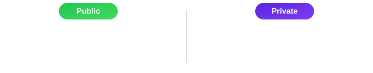

  

 

  Born in 2003 · Based in Turkey
   
  4th-year Computer Engineering student at
  <a href="https://www.ogu.edu.tr/">Eskişehir Osmangazi University</a>

 

  &nbsp;&nbsp;&nbsp;&emsp;&emsp;&emsp;
  &nbsp;&nbsp;&nbsp;&emsp;&emsp;&emsp;
  

 

  

 

  
  &emsp;&emsp;
  

